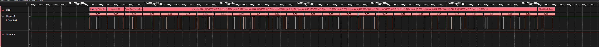

# CRSF-HLA
Saleae Logic 2 High Level Analyzer: Crossfire decoder for R/C protocol as used by TBS Crossfire, Tracer or ExpressLRS

## Getting started 🛠️

1. Install the CRSF analyzer in Logic 2 from the extensions menu. 😉
2. Create a new 'Async Serial' analyzer, set the baud rate to 420000, 8N1, LSB, non-inverted.
3. Create a new 'CRSF' analyzer, configure it and pick the previously created 'Async Serial' analyzer.
4. Done. 🚀

## Features ✨

This is still a very early release. Currently full decoding of the following frames are supported:

* Link statistics (0x14)
* RC channels packed (0x16)
* Battery Sensor Packet (0x08)
* Flight Mode (0x21)
* Gps Packet (0x02)(Experimental need testers)
* Heart Beat Packet (0x0B)
* Ping (0x28)
* Attitude (0x1E)
* Device info (0x29)

It currently Contains the following features:

* CRC check
* Destination device address
* Selectable Channel value units
* payload length check for different packets
* basic error handling

The decoder features a state machine that parses all frames so it can easily be extended to decode future frames.  
Some groundwork for additional frames already exists.

## ToDo ☝️

* units of gps and others
* altitude, pitch role yaw are to be checked
